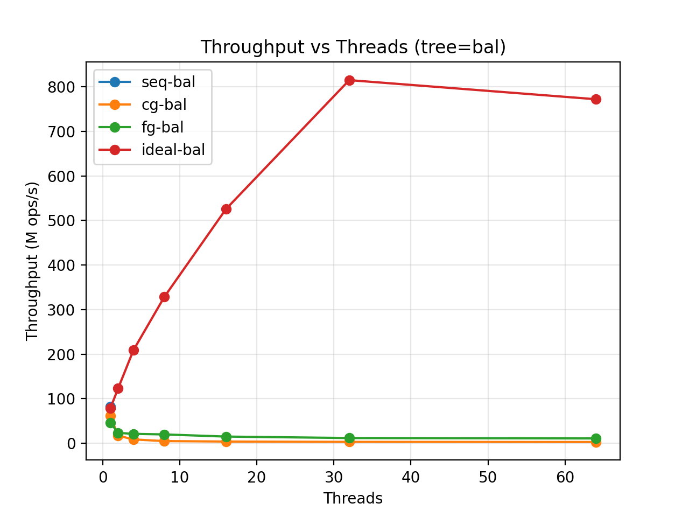
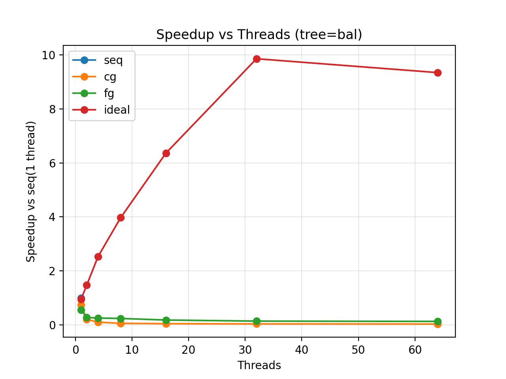

# BST Synchronization Schemes — HPC Benchmark

[](https://en.wikipedia.org/wiki/C99)
[](https://en.wikipedia.org/wiki/Pthreads)
[](https://icl.utk.edu/papi/)

Benchmarking Binary Search Tree (BST) search operations under multiple synchronization schemes to analyze **scalability**, **contention**, and **throughput** as thread count increases.

---

## Results

### Throughput Scaling


### Speedup Analysis


---

## Synchronization Modes

| Mode | Strategy | Use Case |
|------|----------|----------|
| `seq` | No locks (sequential baseline) | Single-threaded reference |
| `cg` | Coarse-grained global mutex | Simple but high contention |
| `rwlock` | Global RW-lock | Concurrent readers, but writers serialize the whole tree |
| `ideal` | Lock-free parallel reads | Upper bound (read-only) |

> Note: `rwlock` — global RW-lock (concurrent readers). This was previously
> labeled "fg" (fine-grained); renamed for honesty — true per-node
> fine-grained locking is implemented in `bst_handover` (added on Day 2).

---

## Quick Start

### Build

```bash
# With PAPI hardware counters (recommended)
make clean && make USE_PAPI=1

# Without PAPI
make clean && make USE_PAPI=0
```

### Run Single Experiment

```bash
# Usage: ./bench N_INIT N_SEARCH N_THREADS MODE [TREE]

# Sequential baseline
PAPI=1 ./bench 1000000 50000000 1 seq bal

# Coarse-grained (8 threads)
PAPI=1 ./bench 1000000 50000000 8 cg bal

# Global RW-lock (8 threads)
PAPI=1 ./bench 1000000 50000000 8 rwlock bal

# Ideal upper bound (8 threads)
PAPI=1 ./bench 1000000 50000000 8 ideal bal
```

---

## Reproduce Full Experiment

```bash
# 1. Run sweep (generates raw data)
chmod +x scripts/run_sweep.sh
./scripts/run_sweep.sh
# Output: data/results_raw.csv

# 2. Summarize results (mean/std/IPC)
python3 scripts/summarize_results.py
# Output: results.csv

# 3. Generate plots
python3 -m venv .venv && source .venv/bin/activate
pip install -r requirements.txt
python3 scripts/plot_results.py
deactivate
# Output: plots/
```

---

## Tree Construction Options

| Option | Description |
|--------|-------------|
| `bal` | Perfectly balanced tree (default) |
| `seq` | Sequential inserts 0..N-1 (worst case) |
| `rand` | Random insertion order |

---

## Repository Structure

```
├── src/              # C source (bench + modes + PAPI wrapper)
├── include/          # Header files
├── scripts/          # Automation scripts
│   ├── run_sweep.sh
│   ├── summarize_results.py
│   └── plot_results.py
├── data/             # Raw measurement CSVs
├── plots/            # Generated visualizations
└── docs/             # Reports and documentation
```

---

## Requirements

| Component | Required | Notes |
|-----------|----------|-------|
| GCC | Yes | C99 compatible |
| Make | Yes | Build system |
| Pthreads | Yes | Standard on Linux |
| PAPI | Optional | Hardware counters |
| Python 3 | Optional | Only for plotting |

---

## License

MIT
